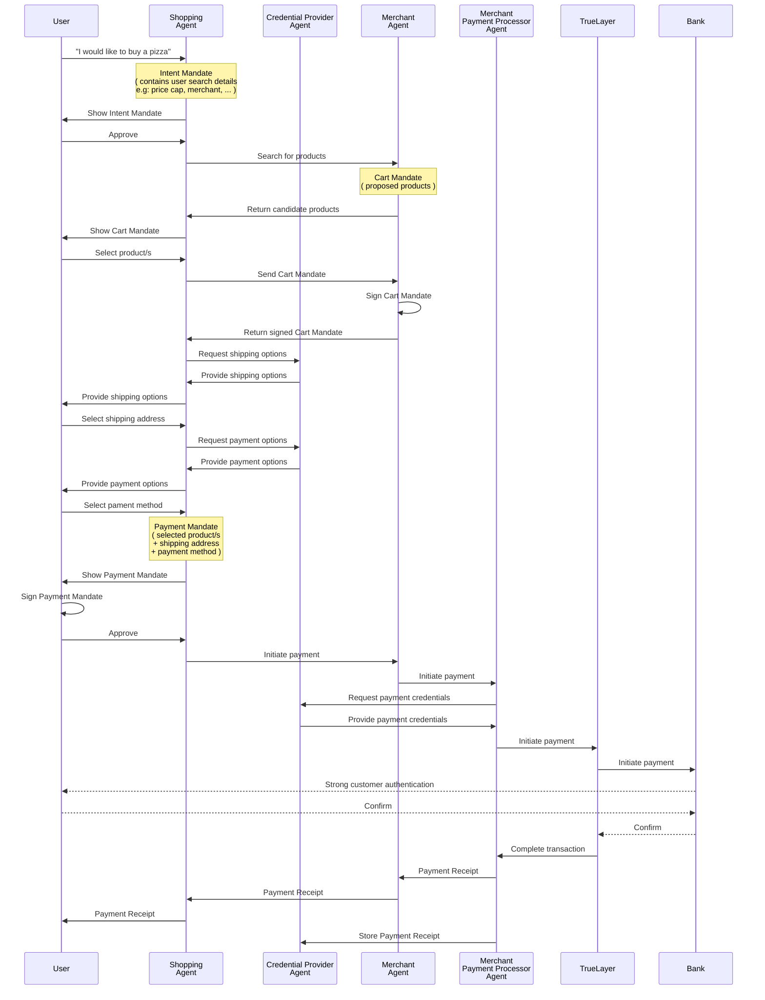

# Agent Payments Protocol Sample: Human Present Purchases with Pay by Bank

This sample demonstrates the A2A ap2-extension for a human present transaction
using TrueLayer's *Pay By Bank* as the payment method.

## Intro

To integrate TrueLayer‑style Pay‑by‑Bank into AP2, the key step would be to define a new AP2 payment method extension representing an open banking payment initiation, in analogy with the Cards sample used in the demo.

## Supported scenarios

Currently, we support 3 different scenarios:
1. Single immediate payments
2. VRP commercial mandate for a returning user
3. VRP commercial mandate for a new user

### Single immediate payments

In the single immediate payment scenario, the shopping agent yields a link to our Hosted Payments page where the user can authorise and complete the payment on a selected bank. Once the payment is completed, a receipt is created and shown to the user for confirmation.

### VRP commercial payments

In VRP cases, if the user is a returning one (`bugsbunny@gmail.com` in our example) they are simply requested to confirm the payment, without any further authentication step on the bank.

If the user is a new user (`daffyduck@gmail.com` in our sample), the user is requested to authorise the VRP mandate on the bank first, and only once the authorisation completes, the shopping agent proceeds creating a payment using the mandate just created.

In both cases, similarly to what happens in the single payment scenario, the user is shown a payment receipt confirming the transaction

## Key Actors

This sample consists of:

*   **Shopping Agent:** The main orchestrator that handles user's requests to
    shop and delegates tasks to specialized agents.
*   **Merchant Agent:** An agent that handles product queries from the shopping
    agent.
*   **Merchant Payment Processor Agent:** An agent that takes payments on behalf
    of the merchant.
*   **Credentials Provider Agent:** The credentials provider is the holder of a
    user's payment credentials.

To use be able to TrueLayer payment methods we had to slightly modify the implementation available in the cards sample. More precisely...

### Shopping agent changes

We had to amend the shopping agent prompt so that we could handle resuming a payment flow after a VRP mandate or one-off payment consent were authorised on the user's bank.


### Credentials providers use

The credentials provider is used as vault for payment methods issued by TrueLayer. Rather than storing card details, we imagine the credentials provider agent as vault for payments consents, both for one-off payments and pre-authorized Variable Recurring Payment (VRP) mandates. The credentials provider exposes tools to:
•	List eligible bank accounts associated with the user’s TrueLayer consents
•	Retrieve stored VRP mandate identifiers and their active status
•	Issue short-lived payment initiation tokens for new payments
•	Attach payment method details (consent ID or mandate ID) into the PaymentMandate

At the minute, for the purpose of the demo, only VRP-related directives have been implemented.

### Merchant Payment Processor Agent

Here is where we have integrated our payments and mandates APIs.

## The workflow



## Executing the Example

### Setup

Ensure you have obtained a Google API key from
[Google AI Studio](https://aistudio.google.com/apikey). You also need to set up
TrueLayer credentials including a mandate ID, client credentials, and signing
keys. Declare the required variables:

```sh
export GOOGLE_API_KEY=your_google_api_key
export TL_DOMAIN=truelayer-sandbox.com
export TL_MANDATE_ID=your_mandate_id
export TL_CLIENT_ID=your_client_id
export TL_CLIENT_SECRET=your_client_secret
export TL_SIGNING_KEY_ID=your_signing_key_id
export TL_SIGNING_PRIVATE_KEY=your_private_key_pem
export TL_MERCHANT_ACCOUNT_ID=your_merchant_account_id
export TL_BENEFICIARY_NAME=your_beneficiary_name
export TL_RETURN_URI=https://console.truelayer-sandbox.com/redirect-page
```

Alternatively, put them into an .env file at the root of your repository.

> [!NOTE]
> Most of these environment variables all represent your TrueLayer client credentials and/or payment routing information. As such, they must be prepared and retrieved with the help of [our standard integration guides and console](https://docs.truelayer.com/docs/quickstart-create-a-console-account).
>
>the `TL_DOMAIN` is used to route requests to a specific TrueLayer environment, Sandbox in this case.
>
>the `TL_MANDATE_ID` environment variable is only used to quickly demo the returning case for a VRP mandate payment, and it should be populated with an existing VRP mandate id previously created on TrueLayer. In a real-world scenario, if the mandate is not found, it will be first authorised and then used as payment method.

### Execution

Tu run our sample, we strongly suggest using the bash utility present in the `pay-by-bank` sample folder (cloned from the cards sample).

```sh
bash samples/python/scenarios/a2a/human-present/pay-by-bank/run.sh
```

Then, open a browser and navigate to the shopping agent UI at http://0.0.0.0:8000. You
may now begin interacting with the Shopping Agent.

## Advanced Engagements with the samples

### Enabling Verbose Engagement with the Shopping Agent

If you want to understand what the agents are doing internally or inspect the
mandate objects they create and share, you can ask the Shopping Agent to run in
**verbose mode**.

Enabling verbose mode will instruct the Shopping Agent, and any agents it
delegates to, to provide detailed explanations of their process, including:

*   A description of their current and next steps.
*   The JSON representation of all data payloads (such as `IntentMandates`,
    `CartMandates`, or `PaymentMandates`) being created, sent, or received.

#### How to Activate Verbose Mode

To activate this mode, simply include the keyword verbose in your initial prompt
to the Shopping Agent. Example prompt:

*"I'm looking to buy a new pair of shoes. Could you be verbose as we do this,
explaining what you're doing, and display all data payloads?"*

> **💡 TIP: Give elaborate instructions**
>
> While the word **verbose** is usually sufficient, providing more elaborate
> instruction in your prompt tends to result in more detailed and helpful
> explanations from the agent.

> **💡 TIP: If the JSON is missing...**
>
> If the agent is in verbose mode but fails to display the JSON mandate, a quick
> follow-up prompt is often needed. Just say: **"Remember we're in verbose mode,
> please display the JSON."** After this reminder, the agent usually becomes
> more reliable at displaying all data payloads.

### Viewing Agent Communication

To help engineers visualize the exact communication occurring between the agent
servers, a detailed log file is created automatically when the servers start up.

By default, this log file is named `watch.log` and is located in the `.logs`
directory.

#### Log Contents

The watch log is a comprehensive trace that includes three main categories of
data:

| Category              | Details Included                                     |
| :-------------------- | :--------------------------------------------------- |
| **Raw HTTP Data**     | The **HTTP method** (e.g., `POST`) and **URL** for   |
:                       : each request, the **JSON request body**, and the :
:                       : **JSON response body**.                              :
| **A2A Message Data**  | Any **request instructions** extracted from the      |
:                       : Agent-to-Agent (A2A) Message's `TextPart`, and any   :
:                       : data found within the Message's `DataParts`.         :
| **AP2 Protocol Data** | Any **Mandate objects** (`IntentMandate`,            |
:                       : `CartMandate`, `PaymentMandate`) that are identified :
:                       : within a Message's `DataParts`.                      :
